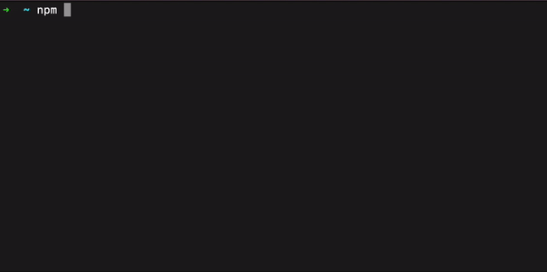

# ⚙️ Top-Post CLI
Top-Post is a command line tool to get the current top hacker news articles. Currently it is unfinished and still heavily work in progress.

## 🖥 Demo

## 🎯 Goals
What is the goal of the project?

- Be a simple-to-use, intuitive tool to get current top articles
- Have an interface to easily extend the tool for other news/articles provider
- Be minimilastic - aim to be a cool tool for .bashrc/.zshrc

## 💅🏻 Current features

- Get the current top x hacker news articles

## 📄 How-To

To install the package, get the latest version with following command: 
```bash
npm install -g top-post
```
Then show the current top-article with following command:
```
top-post
```